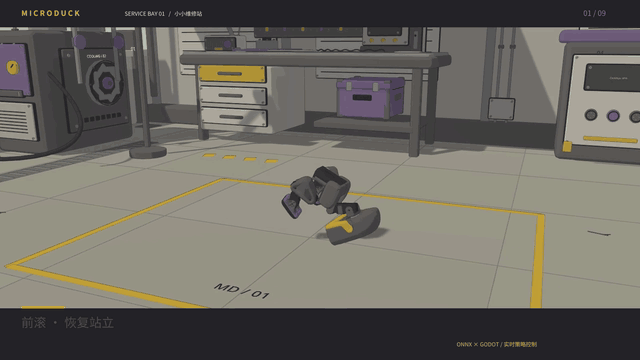
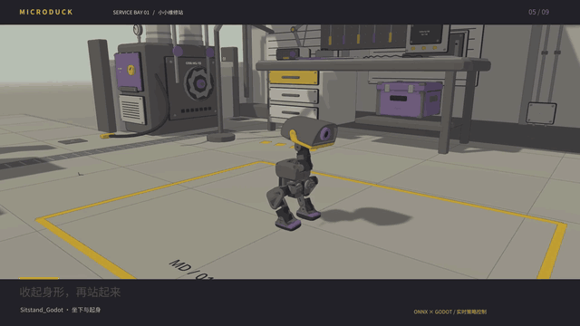
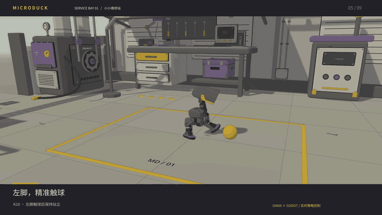
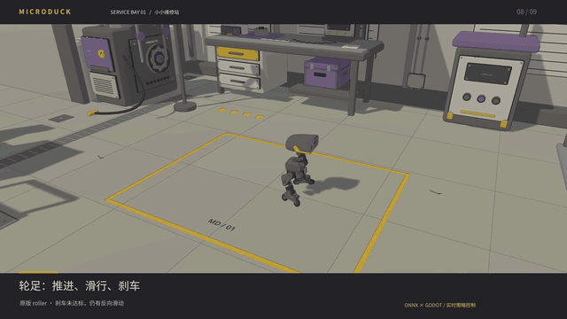

# MicroDuck · 小小维修站

**小小身体，自主行动。** 在莫比乌斯式维修站里，观看九个 ONNX 策略驱动的真实机器人动作。

[](https://raw.githubusercontent.com/sgyli7/MicroDuck-Godot-Simi2Sim/main/docs/media/microduck-service-bay-15s.gif)

**[▶ 20 秒 1080p PV 与完整原片](https://github.com/sgyli7/MicroDuck-Godot-Simi2Sim/releases/tag/atelier-20260910-short)** · **[启动维修站](docs/showcase.md#运行最新模型的维修站)** · **[训练结果](RESEARCH_RESULT_20260910.md)**

动图约 13 秒，开场直接前滚；若 GitHub 暂停动图，点图可直接播放。

站立、行走、坐起、低头拾取、左右踢球、前滚、轮足与下蹲滑行。真实 ONNX 控制、Godot/Jolt 物理，剪辑保留实际速度。
本次使用最新选定九模型包；其中包含新训练结果和保留的旧／原版策略。轮足刹车尚未达标，在片中明确标记。

**场景更新：** 修复共面闪烁，维修站加入真实碰撞，以及 **6–15 克的动态箱、瓶、小球**。
**B** 选踢击目标，**3 / 4** 左右踢，**0** 归位。
[12 秒动态物件实录](https://raw.githubusercontent.com/sgyli7/MicroDuck-Godot-Simi2Sim/main/docs/media/loose-props.mp4) · [动态刚体验证](docs/loose_props.md) · [闪烁修复对照](docs/workshop_contacts.md)。上方九技能 PV 保留原平地演示模式。

<details>
<summary>展开动作特写 · 姿态 / 踢球与前滚 / 轮足</summary>

**收起身形，贴近地面。** 坐下、起身与低头动作。



**触球，翻滚，再站起来。** 左右脚触球与前滚恢复。



**压低重心，滑出工位。** 轮足推进与下蹲滑行；连续刹车仍有反向滑动。



</details>

## MuJoCo → Godot / Jolt

MuJoCo 训练出的 ONNX policy，在 **Godot 4.7 + 内置 Jolt** 上当第二个物理后端重放，并和 MuJoCo lockstep 对比。

Python 是唯一控制器。编译后的 `MjModel` 是模型真源；ONNX 只在 Python 里跑。这不是「Godot 里嵌 MuJoCo」也不是 Hakoniwa 那种 viewer，而是 **sim2sim**：两端各自步进，能量化 walk / run 是否还站得住。

详细映射、已知不映射项、训练循环和门禁数字见 [SIM2SIM.md](SIM2SIM.md)。

2026-09-10 研究结果与候选模型见 [实验报告](RESEARCH_RESULT_20260910.md)；
新克隆的场景准备、实验初始化、模型包校验与复测见 [复现说明](REPRODUCING.md)。
九个 ONNX 通过独立模型包交付，不随 Git clone 下载。
[HANDOFF.md](HANDOFF.md) 保留此前八技能训练的历史交接，当前方案以研究报告为准。

## 需要

- Godot **4.7.2**（`godot` 在 `PATH`，或 `export GODOT=...`）
- Python 3.12 + [uv](https://docs.astral.sh/uv/)
- [microduck_rl](https://github.com/pollen-robotics/microduck_rl) 的 MJCF（本仓不发布 NC 网格）
- ONNX：官方 `alpha_walking.onnx` 或你自己训的权重（本仓不提交 `.onnx`）

```bash
export MICRODUCK_RL=$HOME/Projects/microduck_rl
export MICRODUCK_POLICIES=$HOME/Projects/MicroDuck/policies   # 或任意放 onnx 的目录
export PATH="$HOME/.local/bin:$PATH"
export DISPLAY="${DISPLAY:-:1}"

cd MicroDuck-Godot-Simi2Sim
uv sync                      # 基础门禁；会卸掉未在 pyproject 声明的 extra
uv sync --extra train        # 训练 / eval / export（装一次）
./run.sh                     # convert → spikes → calib → dual rollout → compare
uv run --no-sync sim2sim-play      # 窗口；按住 W/↑ 才走
uv run --no-sync sim2sim-play --local-ppo
uv run --no-sync sim2sim-play --scene res://scenes/rough_forest_play.tscn

# Godot/Jolt PPO 微调（详见 SIM2SIM.md「训练循环」）
./scripts/train_walk_godot.sh --config configs/walk_godot.yaml --init-onnx alpha
./scripts/walk_godot_smoke.sh
uv run --no-sync sim2sim-play --walking policies/Walk_Godot.onnx
uv run --no-sync sim2sim-eval-walk --a "$MICRODUCK_POLICIES/alpha_walking.onnx" --b policies/Walk_Godot.onnx
uv run --no-sync sim2sim-export --checkpoint path/to/model_k.pt --out policies/Walk_Godot.onnx
uv run --no-sync sim2sim-bench-godot --workers 1 4 8 16
./scripts/train_skills_godot.sh          # 8 技能 continue-train 入口
# 对齐需求与交接：HANDOFF.md（不要把 sim2sim-eval-skill 当验收）
```

之后训练相关命令用 `uv run --no-sync`（或 `./scripts/train_walk_godot.sh`，它 `exec` `.venv/bin/sim2sim-train`，SIGINT 能进 checkpoint）。裸 `uv sync` 会卸掉 `[train]` extra；`./run.sh` 用 `uv sync --inexact` 保住它。不要 `kill` `uv run` 包装进程，信号到不了 Python。

崎岖森林地形要先跑 `godot/scripts/setup_forest_vendor.sh`（克隆 [godot-forest-demo](https://github.com/GamesNotDeveloped/godot-forest-demo)，CC BY 4.0，需署名）。默认平地 `main.tscn` 不依赖 vendor。

## 环境变量

| 变量 | 含义 |
|---|---|
| `SIM2SIM_ROOT` | 本仓库根。一般不用设 |
| `MICRODUCK_RL` | `microduck_rl` 检出路径 |
| `MICRODUCK_POLICIES` | ONNX 目录 |
| `GODOT` | Godot 可执行文件，默认 `~/.local/bin/godot` |
| `SIM2SIM_RESEARCH_DIR` | 新实验目录；先按复现说明初始化，避免使用已结束的旧预算 |

`robots/*.json` 里的路径用 `${MICRODUCK_RL}` / `${MICRODUCK_POLICIES}` / `${SIM2SIM_ROOT}`，不要写死本机绝对路径。

## 布局

```
src/mjcf2godot/    MJCF → Godot 场景
src/sim2sim/       双后端、obs、policy、校准、compare、play、train
godot/             Godot 4.7.2 + Jolt 工程
robots/            机器人 JSON
configs/           walk_godot.yaml 等
scripts/           train_walk_godot.sh、walk_godot_smoke.sh
```

协议是 TCP 行分隔 JSON（MuJoCo 坐标系）。`hello` / `reset` / `step`（可选 `report: "lite"`）/ `pin` / `nudge` / `set_tau_limit` / `close`。

## 许可

- 本仓库原创代码：**Apache-2.0**（[LICENSE](LICENSE)）
- 第三方与可选森林资源：[NOTICE](NOTICE)
