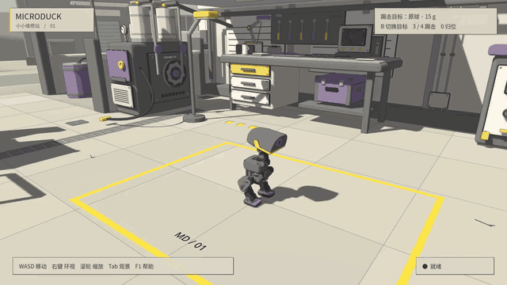
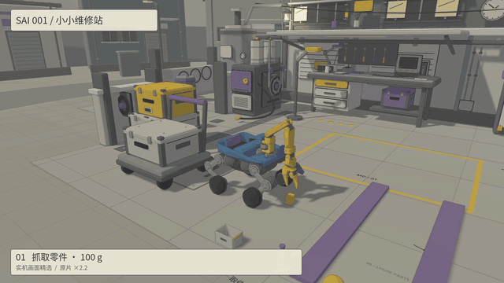
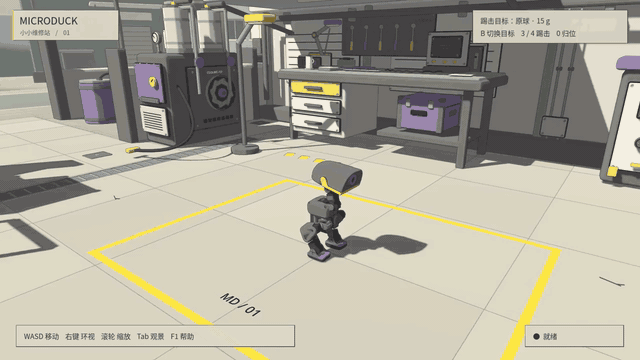

# Robot Godot Sim2Sim

将 MuJoCo 训练的机器人控制策略迁移到 **Godot / Jolt**，在墨比斯风格的「小小维修站」和「风口科学站」中运行真实刚体物理。支持 MicroDuck、MD 轮滑版和 Sai Robot 001，三种机器人可在同一游戏窗口中动态切换。

**风口科学站 · Sai Robot 001**


[15 秒 1080p PV](docs/science-station/media/sai-windpass-15s.mp4) · [原速观赏短片](docs/science-station/media/sai-windpass-film.mp4) · [启动、六张实机截图与验收](docs/science-station.md)

`./run-workshop.sh --scene science_station --robot sai` 进入新场景。48 × 40 米科学站、两座观测塔、三处物理互动区和起伏丘陵，保留 20 × 12 米大型设备泊位。桌面入口「风口科学站」提供新旧场景选择。



**Sai Robot 001 · 小小维修站工作 PV（固定机位重录）**



[观看新版 15 秒 1080p PV](docs/media/sai-workshop-15s.mp4) · [验收结果与截图](docs/workshop-hub-20260912/RESULT.md) · [新版原片与轨迹](https://github.com/sgyli7/Robot_Godot_Sim2Sim/releases/tag/workshop-pv-stable-20260912)

准备好模型和原生库后，运行 `./run-workshop.sh` 一键进入维修站。**F5 / F6 / F7** 切换机器人；Sai 任务菜单提供入仓运输和 20/40/60mm 上下阶。完整准备与按键见 [维修站运行说明](docs/workshop-hub.md)。

Linux 应用菜单入口统一为 **小小维修站**。在项目中运行 `python3 scripts/install_workshop_desktop.py` 安装；旧版两个快捷方式会自动备份并归并到新入口。

新增探索场景：[风口科学站](docs/science-station.md)。运行 `./run-workshop.sh --scene science_station`，或通过桌面入口选择场景。

## 功能

- 同一个维修站窗口中动态加载三种机器人，保留场景物件。
- Sai alpha.3 发布模型与 ONNX：W/S、A/D、Shift 蹲起、R 复位，SO101 抓取入仓与夹紧运输。

- 从编译后的 MuJoCo 模型生成 Godot 刚体、碰撞和关节。
- 由 Python 运行 ONNX 策略，同步推进 MuJoCo 与 Jolt，采集并对比轨迹。
- 支持站立、行走、踢球、翻滚和轮足等动作，以及键鼠交互。
- 支持 Godot / Jolt 环境中的 PPO 微调与策略评估。

<details>
<summary>完整技能与场景演示</summary>

**技能演示**


**行走与跟随视角**



**轻质刚体交互**


**Godot 场景**


</details>

## 快速开始

需要 Python 3.12、[uv](https://docs.astral.sh/uv/)、Godot 4.7.2，以及 [microduck_rl](https://github.com/pollen-robotics/microduck_rl) 的机器人资源和 ONNX 权重。

```bash
git clone https://github.com/sgyli7/Robot_Godot_Sim2Sim.git
cd Robot_Godot_Sim2Sim
uv sync

export MICRODUCK_RL=/path/to/microduck_rl
export MICRODUCK_POLICIES=/path/to/onnx_models
export GODOT=/path/to/godot

uv run --no-sync python -m sim2sim.research.setup scenes
uv run --no-sync sim2sim-play
```

机器人网格与模型权重需单独准备。资源配置和模型加载见[运行说明](REPRODUCING.md)。

## 文档

- [物理映射、校准与双后端对比](SIM2SIM.md)
- [环境配置、模型加载与复现](REPRODUCING.md)
- [实验结果](RESEARCH_RESULT_20260910.md)
- [Godot 交互场景](docs/showcase.md)

## 许可

原创代码采用 [Apache-2.0](LICENSE)。第三方软件、机器人资源及其许可见 [NOTICE](NOTICE)。
