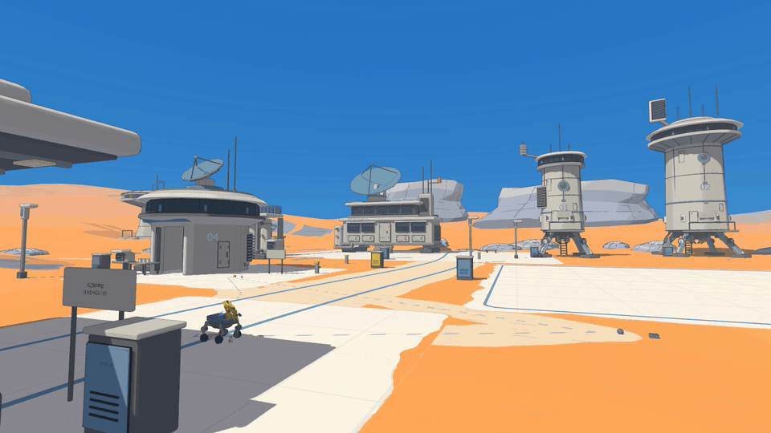
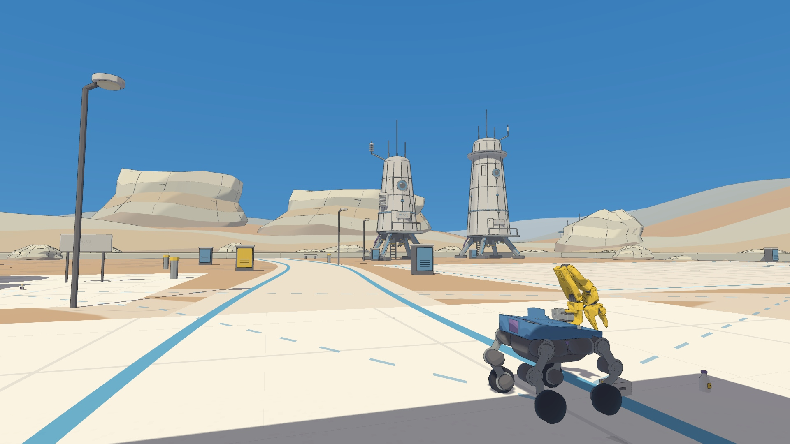
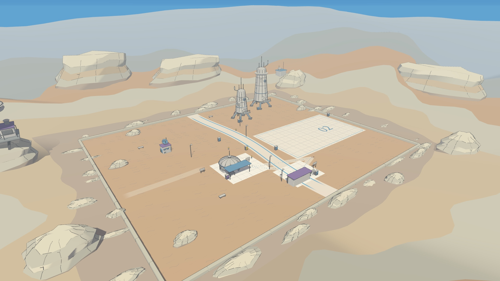
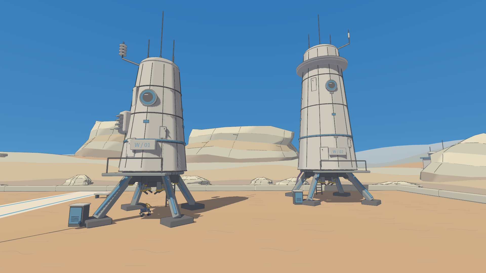
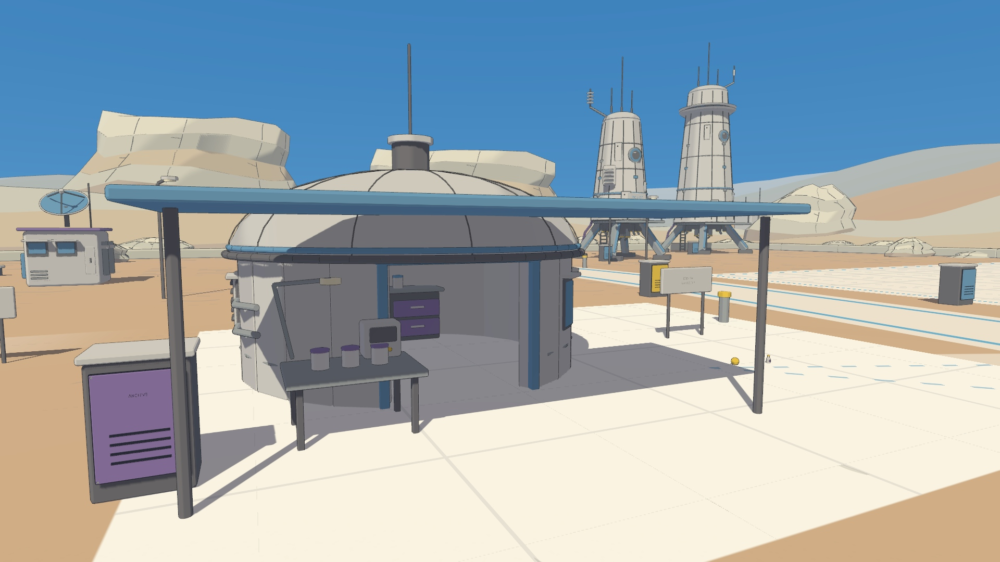
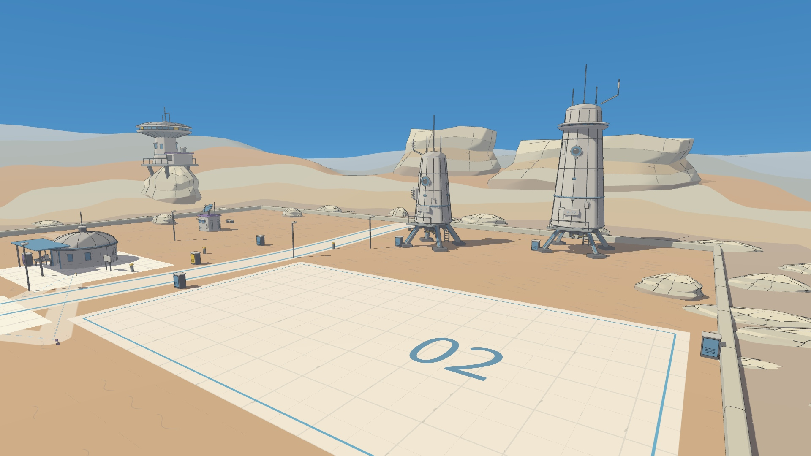
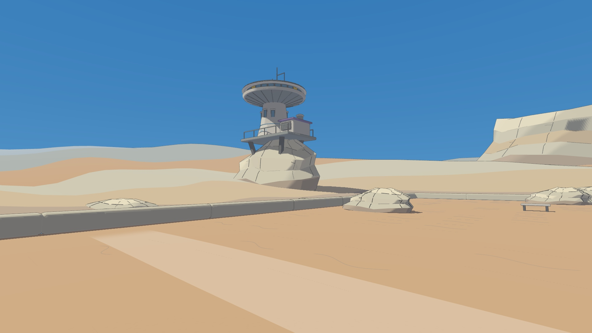

# 风口科学站

可启动的独立探索场景，原维修站保留。站点约 48 × 40 米，包含服务小院、样本圆顶舱、两座 7／10 米观测塔和 20 × 12 米空设备泊位。外围西侧有高 14 厘米、宽 12 米的真实缓坡，站外是完整三维丘陵与远处观测屋。

## 启动

本机应用列表已新增 **风口科学站**。打开后选择科学站或小小维修站，回车默认进入科学站。原有维修站桌面入口保持独立。

本机交付目录：`/home/ethan/Projects/MicroDuck-ScienceStation`，分支 `codex/science-station`。

```bash
cd /home/ethan/Projects/MicroDuck-ScienceStation
./run-workshop.sh --scene science_station
./run-workshop.sh --scene science_station --robot sai
./run-workshop.sh --scene workshop
# 场景选择界面
./scripts/run-worlds-desktop.sh
# 在另一台已准备原生模型的设备上安装入口
python3 scripts/install_worlds_desktop.py
```

无参数命令行和已有自动验收仍默认进入维修站。首次在新机器准备依赖与原生机器人模型，见 [维修站说明](workshop-hub.md)。桌面启动日志位于 `~/.local/state/robot-godot-worlds/desktop.log`。

## 探索与交互

- **F5／F6／F7**：MicroDuck、轮足 MicroDuck、Sai。三者使用现有模型、策略和物理配置；已合入主分支最新的 MicroDuck 普通步行／sprint 模型组合。
- **WASD**：移动、转向；右键拖动环视，滚轮缩放。
- **Tab**：科学站依次切换六个观景机位，再回到跟随视角。维修站切换观景／跟随。
- **MicroDuck**：B 选择附近踢击目标，K／L 左右踢；左 Shift + W 加速，可同时 A／D 转向，松开 Shift 恢复普通步行。
- **Sai**：B 选择附近物件，G 辅助靠近并抓取入仓，X 取消／松开。首次建议抓出生点前方的小收纳盒。
- **0**：回到最近的已到达安全点，并复位六件物件。自由切换机器人也在最近的已到达安全点生成，但保留物件状态。

服务小院、样本站与设备泊位各有两件轻物件和安全点。科学站只选择 1.6 米内物件；先靠近再交互。Sai 沿用当前维修站的 IK 与物理抓取辅助，成功后物件由货仓接触支撑。它是游戏交互，不代表新增的接触抓取训练策略。

沿蓝色线路走主环路，向西进入岩丘步道。塔楼支腿独立碰撞，底层可以穿行；上层与站外远山作为建筑景观。近处可达地面与碰撞来自相同三角网格，地表标线直接绘在地面材质内。

## 实机画面

**Sai · 风口科学站 PV**：服务小院出发、样本站抓取、双塔支腿间移动、西侧缓坡探索。四个固定远机位，隐藏操作界面；按真实墙钟时间剪辑，没有加速或机器人动画替代。



[15 秒 1080p PV](science-station/media/sai-windpass-15s.mp4) · [更长的原速影片](science-station/media/sai-windpass-film.mp4) · [剪辑配方](science-station/pv-edit.json) · [逐镜头采集验证](science-station/media/pv-validation.json)


六张截图均为 Godot 原生 1920 × 1080 视口，没有绘画后处理。下列早期交互验收短片保留游戏界面与原始时间；最新建筑和光照以 PV 与六张截图为准。

[移动与踢碰短片（23 秒）](science-station/media/science-station-play.mp4) · [Sai 完整抓取（52 秒，原速）](science-station/media/science-station-grab.mp4) · [六张截图目录](science-station/media/) · [视觉研究与设计取舍](science-station/art-direction.md)



| 全景 | 塔底与机械结构 |
|---|---|
|  |  |
| 样本处理站 | 设备泊位 |
|  |  |



## 验收

[14 项原生回放结果](science-station/acceptance.json)全部通过：三种机器人分别完成主环路、缓坡往返和塔底通道；切换／复位保留或恢复正确的物件状态；Sai 抓取入仓、取消以及 MicroDuck 踢碰均通过。旧维修站的 17 项既有回归检查通过。测试只回放正常按键，移动过程中不写入机器人位姿或速度。合入主分支最新步行策略后，针对下行前倾问题拓宽了西侧坡面；[单程诊断与修正记录](science-station/terrain-adaptation.json)保留了失败和通过数据，坡道完整往返重新验收，模型与物理参数未改动。

[几何检查](science-station/geometry.json)通过：30 块地形、实际地表高度、两座塔的横向通道、完整泊位、六件物件、越过坡脊的相机避障及远景闭合接缝。[相机回放](science-station/camera.json)覆盖塔底 360° 右键环视、滚轮和六机位切换。

[性能记录](science-station/performance.json)：DGX Spark／GB10，Godot 4.7.2 Forward+，1080p，限制在两个 CPU 核心并降低进程优先级，在有其他评估任务的共享主机上测试。MicroDuck 录制时、轮足版常规游玩均为中位 30 FPS；Sai 常规游玩中位 30 FPS、最低 29 FPS，仿真／墙钟比约 0.998。Sai 同时保存高清帧时中位约 18 FPS、仿真／墙钟比约 0.896，这是录制开销，不将其计作 30 FPS 通过。物理步长与策略频率没有为帧率降低。

最终版本使用 8192 阴影图集与高质量过滤，重新测试正常游玩：MicroDuck 和轮足版最低／中位均为 30 FPS；Sai 完整抓取最低 29、中位 30 FPS，仿真／墙钟比约 1.000。最新 PV 以 15 Hz 保存高清帧，再输出 12 FPS GIF；采集频率与游戏渲染、物理频率分别记录。

画面经过多个机位检查。阴影与极细线条仍受实时阴影分辨率和抗锯齿影响，特别是远距离接缝。这里没有新策略训练、大型载具、任务链或楼内多层探索。

## 复现

首页 PV 的四个镜头可分别重录，然后按同一份墙钟剪辑配方导出。每次录制保留已有资源检查；本机受控共享命令在下方完整验收示例中。

```bash
for zone in service samples towers hills; do
  uv run --extra sai --extra media python scripts/run_science_check.py --scene science_station --robot sai --record --plan "docs/science-station/plans/pv-$zone.json" --output "results/science-station/publication/$zone"
done
uv run --extra sai --extra media python scripts/build_science_pv.py
```


```bash
# 完整原生回放；默认保留既有资源排他检查
uv run --extra sai python scripts/accept_science_station.py
# 已确认可共享资源时，限制在两个 CPU 核心并继续监测压力与训练吞吐
nice -n 10 taskset -c 10,11 .venv/bin/python scripts/accept_science_station.py --share-resources
# 实机截图与正常游玩录制
uv run --extra sai python scripts/run_science_check.py --scene science_station --record --plan docs/science-station/plans/gallery.json --output results/science-station/gallery
uv run --extra sai python scripts/run_science_check.py --scene science_station --record --plan docs/science-station/plans/play.json --output results/science-station/play
uv run --extra media python scripts/build_science_media.py results/science-station/gallery results/science-station/play
```

布局、出生点、道具和机位定义在 `godot/science_station/layout.gd`；建筑、地形与局部细节分别在同目录模块中。`--fast-check` 只用于无窗口计划回放：不等待现实时间，保持原物理步长和控制频率，因此这些回放不作为帧率证据。

本次从当前维修站快照复用了 Sai 抓取模块与 `sai-flat-motion-v1` 平地策略；随附 ONNX 的 SHA-256 为 `094adb4484b3d812dfb8a056491beda34a23fd0fa6f463b7784854ebc354d53d`，原始来源元数据保留在 `src/sim2sim/assets/sai/flat-motion-v1.json`。
